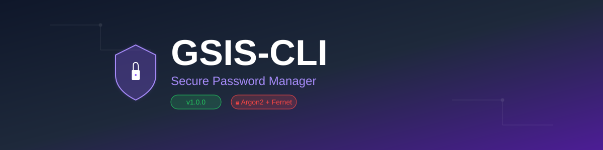

# GSIS-CLI - Secure Sensitive Information Manager



<div align="center">

[](https://www.python.org/downloads/)
[](LICENSE)
[](https://github.com/yourusername/GSIS-CLI)
[](https://www.sqlite.org/)

**A secure and robust password manager with command-line interface**

[Features](#features) • [Installation](#installation) • [Usage](#usage) • [Security](#security) • [Documentation](#documentation)


</div>

---

## 📋 Description

**GSIS-CLI** (Secure Sensitive Information Manager - CLI) is a professional password manager developed in Python that combines enterprise-grade security with an intuitive command-line interface. Designed following the **MVC (Model-View-Controller)** architectural pattern, it guarantees maximum protection of your credentials through state-of-the-art encryption and hashing algorithms.

### 🎯 Why GSIS-CLI?

- **🔒 Enterprise-Level Security**: Implements Argon2id for hashing, PBKDF2 for key derivation, and Fernet (AES-256) for encryption
- **🛡️ Anti-Attack Protection**: Automatic database deletion system after 3 failed attempts
- **🔑 No Persistent Keys**: Encryption keys are derived at runtime via KDF
- **🏗️ Professional Architecture**: Clean code following SOLID principles and MVC pattern
- **📊 Smart Management**: Organize your passwords by categories with expiration dates
- **🔍 Advanced Searches**: Multiple filters to quickly find your credentials
- **📝 Complete Logging**: Logging system for auditing and debugging
- **💻 Intuitive Interface**: Modern and easy-to-use CLI


---

## ✨ Features

### 🔐 Advanced Security

- **Robust Authentication**: Login system with master credentials
- **Argon2id Hashing**: Protection against brute force attacks and rainbow tables
- **PBKDF2 Key Derivation**: Secure encryption key generation via KDF (Key Derivation Function) with 480,000 iterations
- **Fernet Encryption (AES-256)**: State-of-the-art symmetric encryption without persistent key storage
- **Anti-Brute Force Protection**: Automatic database deletion after 3 failed attempts
- **Password Validation**: Integrity verification through hashes

### 📂 Data Management

- **SQLite Database**: Secure and efficient local storage
- **Categorization**: Organize your credentials into custom categories
- **Complete Fields**: Stores site, URL, username, email, password, security level
- **Expiration Dates**: Password expiration control
- **Last Modified**: Change tracking with timestamps

### 🔍 Filters and Searches

1. **View All**: Query all stored credentials
2. **By Website**: Search specific credentials by site name
3. **By Category**: Filter by service type (social media, banks, etc.)
4. **By Date**: Search by month/year of last modification
5. **By Date Range**: Query credentials modified in a specific period

### ⚙️ CRUD Operations

- ✅ **Create**: Add new credentials and categories
- 📖 **Read**: Query with multiple filters
- ✏️ **Update**: Update existing credentials
- 🗑️ **Delete**: Remove records with confirmation

---

## 🚀 Installation

### Prerequisites

- **Python 3.8 or higher**
- **pip** (Python package manager)
- **Git** (optional, to clone the repository)

### Installation Steps

#### 1️⃣ Clone the Repository

```bash
git clone https://github.com/LeoDev2p/GSIS-CLI.git
cd GSIS-CLI
```

#### 2️⃣ Create Virtual Environment (Recommended)

**Windows:**
```powershell
python -m venv .venv
.venv\Scripts\activate
```

**Linux/MacOS:**
```bash
python3 -m venv .venv
source .venv/bin/activate
```

#### 3️⃣ Install Dependencies

```bash
pip install -r requirements.txt
```

#### 4️⃣ Configure Environment Variables

Create or edit the `.env` file in the project root:

```env
# Authentication Credentials
SUPERUSER = "your_email@example.com"
MASTER_KEY = "$argon2id$v=19$m=65536,t=3,p=2$..." # Hash of your master password

# SALT for Key Derivation (PBKDF2)
SALT = "your_base64_salt_here"

# Database Name
NAME_BD = "Secure.db"
```

> **⚠️ IMPORTANT**: Never share your `.env` file. It's already included in `.gitignore`

#### 5️⃣ Generate Security Keys

To generate your SALT (used in PBKDF2 key derivation):

```python
import base64
import os
salt = base64.urlsafe_b64encode(os.urandom(16)).decode()
print(f"SALT = {salt}")
```

To generate your master password hash:

```python
from argon2 import PasswordHasher
ph = PasswordHasher()
print(ph.hash("your_master_password"))
```

---

## 📖 Usage

### Start the Application

```bash
python main.py
```

### Main Menu

Once authenticated, you will see the following menu:

```
╔═══════════════════════════════════════════╗
║           GSIS-CLI - MAIN MENU            ║
╚═══════════════════════════════════════════╝

1. 📊 Create Tables (First time)
2. 📁 Add Category
3. ➕ Add New Credential
4. 🔍 Search/Filter Credentials
5. ✏️  Update Credential
6. 🗑️  Delete Credential
7. 🚪 Exit

Select an option:
```

### Typical Workflow

#### 1. First Run - Create Tables

On first use, select option **1** to create the database tables:

```bash
Select an option: 1
✅ Tables created successfully
```

#### 2. Add Categories

Organize your credentials by creating categories:

```bash
Select an option: 2
Enter category name: Social Media
✅ Social Media added successfully
```

**Suggested Categories**: Email, Banks, Social Media, Work, Streaming, Games, etc.

#### 3. Add Credentials

Save a new password:

```bash
Select an option: 3

📝 Enter credential details:
Site name: Facebook
Category: Social Media
URL: https://facebook.com
Username: my_username
Email: user@example.com
Password: ************
Expiry days: 90
Security level (1-5): 4

✅ Data successfully inserted
```

#### 4. Search Credentials

Access your saved passwords:

```bash
Select an option: 4

╔═══════════════════════════════════════════╗
║          SEARCH/FILTER MENU               ║
╚═══════════════════════════════════════════╝

1. 📋 View All
2. 🔍 Search by Site Name
3. 📁 Search by Category
4. 📅 Search by Month/Year
5. 📆 Search by Date Range
6. ⬅️  Back

Select filter:
```

#### 5. Update Passwords

Modify existing credentials:

```bash
Select an option: 5
Enter site name: Facebook

[Shows current data]

Do you want to update? (Y/N): Y
Enter new username: new_username
Enter new password: ************
...
✅ Facebook successfully updated
```

#### 6. Delete Credentials

Remove records you no longer need:

```bash
Select an option: 6
Enter credential ID: 5

[Shows record information]

Confirm deletion? (Y/N): Y
✅ Facebook successfully removed
```

---

## 🔐 Security

### Implemented Technologies

| Component | Technology | Purpose |
|------------|------------|---------|
| **Hashing** | Argon2id | Master password protection |
| **Key Derivation** | PBKDF2-HMAC-SHA256 | Secure encryption key generation (480k iterations) |
| **Encryption** | Fernet (AES-256-CBC) | Sensitive data encryption without key persistence |
| **Anti-Brute Force** | Attempt System | Automatic database deletion after 3 failed attempts |
| **Database** | SQLite | Local storage |
| **Logging** | Python logging | Operation logging |
| **Logging** | Python logging | Operation logging |


### Implemented Best Practices

✅ **Credential Separation**: Environment variables in `.env`  
✅ **Secure Key Derivation**: PBKDF2 with 480,000 iterations for encryption key generation  
✅ **No Key Persistence**: Encryption keys are derived at runtime and never stored  
✅ **Encryption at Rest**: Passwords encrypted in the database  
✅ **Attack Protection**: Automatic database deletion after 3 failed attempts  
✅ **Input Validation**: SQL injection prevention  
✅ **Exception Handling**: Robust custom error system  
✅ **Secure Logging**: No sensitive data logged  
✅ **Modular Architecture**: Separation of concerns (MVC)  
✅ **Modular Architecture**: Separation of concerns (MVC)


### Security Recommendations

🔒 **Strong Master Password**: Minimum 16 characters with uppercase, lowercase, numbers, and symbols  
🔒 **Secure Backup**: Backup your `Secure.db` file in an encrypted location  
🔒 **Regular Updates**: Change your passwords periodically  
🔒 **Do Not Share**: Never share your `.env` or database

---

## 📁 Project Structure

```
GSIS-CLI/
│
├── 📄 main.py                          # Application entry point
├── 📄 requirements.txt                 # Project dependencies
├── 📄 requirements-dev.txt             # Development dependencies
├── 📄 .env                             # Environment variables (DO NOT SHARE)
├── 📄 .gitignore                       # Files ignored by Git
├── 📄 README.md                        # This file
│
├── 📂 controllers/                     # Business logic
│   ├── Auth_controller.py              # User authentication
│   └── Database_controllers.py         # CRUD operations
│
├── 📂 models/                          # Data models
│   ├── database.py                     # Database configuration
│   ├── safe_models.py                  # Credentials model
│   └── category_models.py              # Categories model
│
├── 📂 views/                           # User interface
│   └── app.py                          # CLI views
│
├── 📂 security/                        # Security modules
│   ├── encryption.py                   # Fernet encryption
│   └── hashing.py                      # Argon2 hashing
│
├── 📂 core/                            # Central configuration
│   ├── config.py                       # Global settings
│   ├── logger.py                       # Logging system
│   └── Exceptions.py                   # Custom exceptions
│
├── 📂 utils/                           # Utilities
│   └── utils.py                        # Helper functions
│
├── 📂 db/                              # Database
│   └── Secure.db                       # SQLite database (generated)
│
└── 📂 log/                             # Log files
    └── app.log                         # Application logs
```

---


## 🛠️ Technologies Used

- **[Python 3.8+](https://www.python.org/)** - Programming language
- **[Argon2-cffi](https://argon2-cffi.readthedocs.io/)** - Password hashing
- **[Cryptography](https://cryptography.io/)** - Fernet encryption (AES-256) and PBKDF2
- **[SQLite](https://www.sqlite.org/)** - Embedded database
- **[python-dotenv](https://pypi.org/project/python-dotenv/)** - Environment variable management
- **[python-dotenv](https://pypi.org/project/python-dotenv/)** - Environment variable management


---

## 📦 Versioning

This project follows the [Semantic Versioning (SemVer)](https://semver.org/) specification.

### Version Format

```
MAJOR.MINOR.PATCH
```

- **MAJOR**: Incompatible changes with previous versions
- **MINOR**: New backward-compatible features
- **PATCH**: Bug fixes

### Version History

| Version | Date | Changes |
|---------|------|---------|
| **1.0.0** | 2026-02-19 | 🎉 Initial GSIS-CLI release with all base features |
| | | - Master password authentication (Argon2id) |
| | | - Fernet encryption (AES-256) for credentials |
| | | - PBKDF2 key derivation (480k iterations) |
| | | - Complete CRUD credential system |
| | | - Password categorization |
| | | - Multiple search filters |
| | | - Anti-brute force protection |
| | | - Complete logging system |
| | | - Intuitive CLI interface |

### Future Plans

- **v1.1.0** - UI/UX improvements
- **v1.2.0** - Import/Export credentials
- **v2.0.0** - Cloud synchronization (E2EE)
- **v2.1.0** - Companion mobile application

---

## 🛡️ Attack Protection System

GSIS-CLI implements a robust protection system against unauthorized access attempts:

### Protection Mechanism

1. **Failed Attempt Logging**: Each incorrect login attempt is automatically recorded
2. **Security Limit**: After **3 failed attempts**, the system activates the protection protocol
3. **Automatic Deletion**: The database is completely deleted to protect your data
4. **Secure Storage**: Failed attempt counter is stored in `%APPDATA%/SystemCacheLogs/win_sys_32.dat`

### Protection Flow

```
Attempt 1 ❌ → Warning + Logging
Attempt 2 ❌ → Critical warning + Logging  
Attempt 3 ❌ → 🔥 AUTOMATIC DATABASE DELETION
```

> **⚠️ IMPORTANT**: This mechanism protects your data against brute force attacks, but means you must remember your master password. Make sure to regularly backup your credentials database in a secure location.

### Security Architecture

- **Key Derivation**: No persistent encryption key is stored
- **PBKDF2-HMAC-SHA256**: 480,000 iterations for encryption key derivation
- **Fernet (AES-256-CBC)**: Sensitive data encryption in the database
- **Argon2id**: Master password hash with GPU attack protection

---

## 🤝 Contributing

Contributions are welcome. To contribute:

1. **Fork** the project
2. Create a **branch** for your feature (`git checkout -b feature/AmazingFeature`)
3. **Commit** your changes (`git commit -m 'Add some AmazingFeature'`)
4. **Push** to the branch (`git push origin feature/AmazingFeature`)
5. Open a **Pull Request**

---

## 📝 License

This project is licensed under the MIT License. See the `LICENSE` file for details.

---

## 👤 Author

**LeoDev Development**

- 📧 Email: whoamy0608@gmail.com
- 🌐 GitHub: [@LeoDev2p](https://github.com/LeoDev2p)

---

<div align="center">

**⭐ If you find this project useful, consider giving it a star on GitHub ⭐**

LeoDev2p Development

</div>
